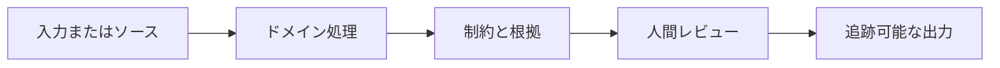
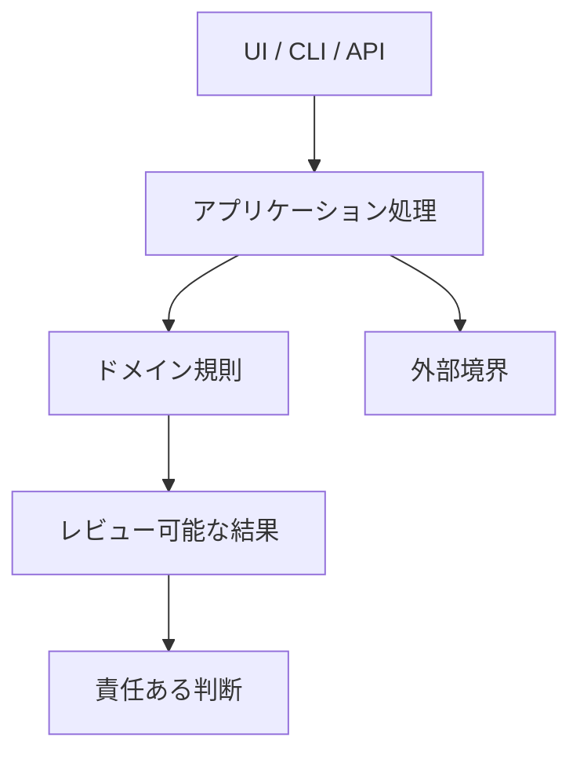

# pcSecPichia 分泌モデル

[English](README.md) · [中文](README.zh.md) · [日本語](README.ja.md) · [한국어](README.ko.md)

> **根拠、制約、人間の最終判断を明示する、面接向けの技術紹介です。**

## なぜ重要か

ソフトウェア出力を未検証の現実世界の結論として扱わず、入力からレビュー可能な成果物までの判断経路を残します。

## プロジェクトの強み

| 強み | 価値 |
| --- | --- |
| ドメイン処理と根拠 | ブラックボックスの推薦ではなく説明可能な結果 |
| 人間中心の境界 | 科学・製品・適合性の最終承認を自動化しない |
| Canon 文書と守衛 | 要件、構造、状態、引継ぎ、決定を混ぜない |

## ワークフロー

## アーキテクチャ境界

## 検証と文書

[Requirements](docs/requirements.md) · [Architecture](docs/architecture.md) · [Execution Plan](docs/EXECUTION_PLAN.md) · [Handoff](docs/handoff.md) · [ADR index](docs/adr/README.md)

Handoff の対象テストと文書守衛を実行してください。現在の状態と停止条件は Execution Plan だけを権威とします。

技術面接の視点

重要なのはフレームワーク名ではなく、計算・根拠・最終責任の境界をどう設計したかです。

> **考察：** 良いエンジニアリングは不確実性を隠さず、次の判断を説明可能にします。 [Personal site](https://77652189.github.io)

