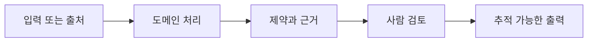
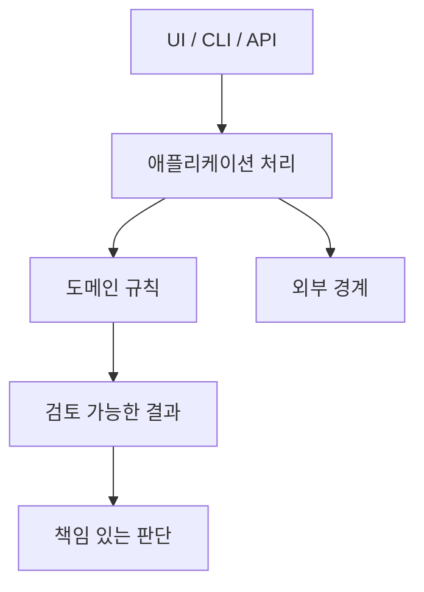

# pcSecPichia 분비 모델

[English](README.md) · [中文](README.zh.md) · [日本語](README.ja.md) · [한국어](README.ko.md)

> **근거, 제약, 인간의 최종 판단을 명시하는 면접용 기술 소개입니다.**

## 왜 중요한가

소프트웨어 출력을 검증되지 않은 현실 결론으로 취급하지 않고, 입력부터 검토 가능한 산출물까지의 판단 경로를 남깁니다.

## 프로젝트 강점

| 강점 | 가치 |
| --- | --- |
| 도메인 처리와 근거 | 블랙박스 추천이 아닌 설명 가능한 결과 |
| 사람 중심 경계 | 과학·제품·컴플라이언스의 최종 승인을 자동화하지 않음 |
| Canon 문서와 가드 | 요구사항, 구조, 상태, 인수인계, 결정을 섞지 않음 |

## 워크플로

## 아키텍처 경계

## 검증과 문서

[Requirements](docs/requirements.md) · [Architecture](docs/architecture.md) · [Execution Plan](docs/EXECUTION_PLAN.md) · [Handoff](docs/handoff.md) · [ADR index](docs/adr/README.md)

Handoff의 대상 테스트와 문서 가드를 실행하세요. 현재 상태와 중단 조건은 Execution Plan만을 권위로 삼습니다.

기술 면접 관점

핵심은 프레임워크 이름이 아니라 계산, 근거, 최종 책임의 경계를 어떻게 설계했는가입니다.

> **생각:** 좋은 엔지니어링은 불확실성을 숨기지 않고 다음 판단을 설명 가능하게 만듭니다. [Personal site](https://77652189.github.io)

