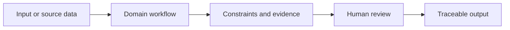
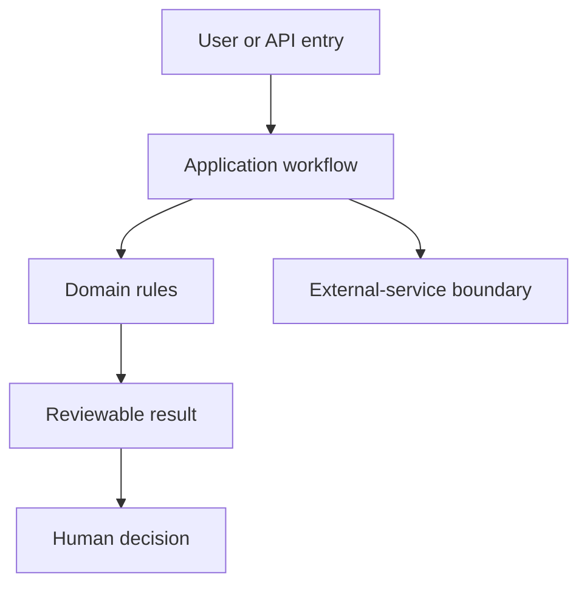

# pcSecPichia Secretion Model

[English](README.md) · [中文](README.zh.md) · [日本語](README.ja.md) · [한국어](README.ko.md)

> **evidence-ranked KO/OE and secretion-pathway candidates for Pichia protein secretion.** It is built for reviewable decisions, not unqualified claims.

## Why it matters

This project makes a high-stakes research or product decision inspectable: inputs, constraints, evidence, and the final human decision remain visible.

## What makes it strong

> **Project-specific spotlight:** Secretion-model candidate screening combines KO/OE simulation, curated complex reachability, protein constraints, and risk disclosure.

| Design choice | Value for an interviewer |
| --- | --- |
| Evidence before recommendation | Results retain source, constraint, and failure context |
| Human decision boundary | The system narrows choices; it does not authorize scientific, compliance, or deployment action |
| Explicit non-goals | Unsupported claims are documented rather than implied by a polished UI |
| Canon + tests | Requirements, architecture, status, handoff, and long-lived decisions remain separately reviewable |

## Workflow



## Architecture boundary



## Quick start

Prepare the supported local environment, then run:

```powershell
python -m streamlit run app/ui/streamlit_app.py --server.address 0.0.0.0 --server.port 8502
```

## Engineering evidence

| Checkpoint | Evidence | Boundary |
| --- | --- | --- |
| Product behavior | Run the focused tests named in Handoff | No output becomes a validated real-world outcome automatically |
| Documentation | Run the repository documentation guard | Current status belongs to the execution plan, not this README |
| Current direction | Read the execution plan before extending scope | RNA-seq data and curator-approved complex-to-gene mappings are still required. |

## Authoritative project documents

| Document | Use it for |
| --- | --- |
| [Requirements](docs/requirements.md) | Scope and capability boundary |
| [Architecture](docs/architecture.md) | Layer rules and protected boundaries |
| [Execution plan](docs/EXECUTION_PLAN.md) | Current authority, gates, and blockers |
| [Handoff](docs/handoff.md) | Current slice and verification |
| [ADR index](docs/adr/README.md) | Long-lived decisions and alternatives |

<details>
<summary>Technical interview lens</summary>

The strongest discussion point is not a framework name: it is the explicit boundary between evidence, computation, and the person who remains accountable for the final decision. Current status and blockers are intentionally linked rather than copied here.
</details>

> **Reflection:** Reliable tools do not hide uncertainty; they make the next decision easier to defend. Explore more work at [my personal site](https://77652189.github.io).
