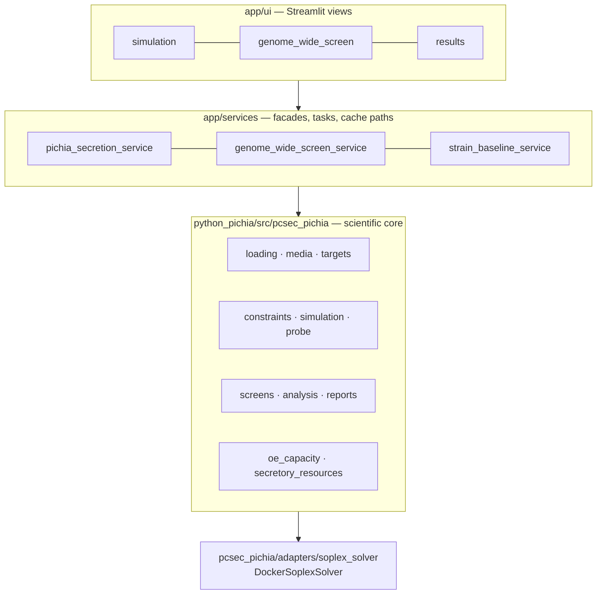

<div align="center">

# pcSecPichia

### Ranks what to engineer next — and refuses to answer what the data cannot support.


[](https://docs.scipy.org/doc/scipy/reference/optimize.linprog-highs.html)
[](https://soplex.zib.de/)
[](python_pichia/tests)
[](docs/adr/002-relative-oe-and-absolute-capacity-layers.md)

[What it does](#what-it-does) · [Quick start](#quick-start) · [Tech stack](#tech-stack) · [Architecture](#architecture) · [The port](#the-port-from-matlab) · [Engineering decisions](#engineering-decisions) · [Boundaries](#boundaries)

[**English**](README.md) · [中文](README.zh.md)

</div>

---

> Ranks gene knockout / overexpression candidates for recombinant protein secretion in *Pichia pastoris*,
> and returns `unavailable` instead of a number wherever the underlying data cannot support one.

A proteome-constrained metabolic model, ported to Python from an upstream MATLAB codebase
([`LiLabTsinghua/pcSecYeastSpecies`](https://github.com/LiLabTsinghua/pcSecYeastSpecies)) and extended
with a screening, attribution and evidence layer. The engineering problem here is not "compute a
number" — it is deciding **which numbers this model is entitled to produce**, and making the rest
fail loudly instead of quietly falling back to a plausible default.

## What it does

| Capability | Entry point |
| --- | --- |
| Genome-wide KO/OE screening — ~1,025 metabolic genes under both directions | [`tools/run_genome_wide_ko_oe_screen_parallel.py`](python_pichia/tools/run_genome_wide_ko_oe_screen_parallel.py) |
| Shadow-price bottleneck attribution — *which* constraint limits secretion, not just *that* it is limited | [`tools/run_target_bottleneck_lp_attribution_check.py`](python_pichia/tools/run_target_bottleneck_lp_attribution_check.py) |
| OE dose–response — quantifies the diminishing return per doubling of expression | [`tools/run_shortlist_dose_response.py`](python_pichia/tools/run_shortlist_dose_response.py) |
| Ranking robustness across capacity assumptions and carbon-source conditions | [`tools/run_shortlist_condition_matrix.py`](python_pichia/tools/run_shortlist_condition_matrix.py) |
| Curated secretory-machinery screen — 61 reactions × KO/OE = 122 candidates | [`screens/genome_wide_tradeoff.py`](python_pichia/src/pcsec_pichia/screens/genome_wide_tradeoff.py) |
| Complex ↔ gene mapping, so complex-level OE becomes a gene a lab can actually build | [`services/gene_complex_mapping_service.py`](app/services/gene_complex_mapping_service.py) |
| Experiment feedback — wet-lab outcomes scored against predicted direction and rank | [`services/pichia_experiment_feedback_service.py`](app/services/pichia_experiment_feedback_service.py) |

Three entry points share one core: a Streamlit UI (`app/ui`), an HTTP API (`app/api`), and 14 batch
tools under `python_pichia/tools/`.

### What the output looks like

> Both figures below use **simulated data** and reproduce the axes, categories and colour coding of
> the real views. Actual values are wet-lab-adjacent and are not published.

Overexpression is swept across a factor grid and the **shape** of the response is classified — that
is the output, not a single number. A shape class survives the fact that the true expression
multiple is unknown, which a fixed `2.0×` point does not.


Bottleneck attribution reads the LP's dual solution and reports which constraint is binding, at row
granularity. The catch is visible in the figure: **the two strongest constraints are lower bounds**,
and overexpression relaxes upper bounds — so ranking by magnitude alone nominates targets that
provably cannot move. `bound_type` is therefore carried through every aggregation level, and the
rule is emitted in the function's own warnings rather than left in a document.


## Quick start

**Browsing existing screening results needs no solver.** That is the whole point of the split below —
the expensive dependency is confined to one adapter, so the read path stays runnable anywhere.

```bash
git clone https://github.com/77652189/pcSecYeastSpecies.git
cd pcSecYeastSpecies
pip install -r requirements.txt
```

```powershell
./run_streamlit.ps1
```

Opens on `http://localhost:8502`. Use `-Port` / `-Address` to change either. On non-Windows hosts, or
if you prefer to skip the launcher:

```bash
PYTHONPATH=.:python_pichia/src python -m streamlit run app/ui/streamlit_app.py --server.port 8502
```

> `python -m streamlit`, not `streamlit run` — the console-script shim puts *its own* directory on
> `sys.path[0]` rather than the repo root, and the `app.*` absolute imports then fail. The launcher
> script sets `PYTHONPATH` for the same reason.

### Running new simulations: SoPlex via Docker

A *new* simulation needs the reference solver. It is reached through one adapter
([`adapters/soplex_solver.py`](python_pichia/src/pcsec_pichia/adapters/soplex_solver.py)) that shells
out to a container — nothing is installed on the host beyond Docker itself.

Build the image once:

```bash
docker build -t pcsec-soplex:24.04 docker/soplex
```

[`docker/soplex/Dockerfile`](docker/soplex/Dockerfile) is Ubuntu 24.04 plus the distro `soplex`
package — that is the entire image. `DockerSoplexSolver` then mounts the LP's directory as the
container workdir and parses the solver output back into a typed result, so a non-optimal solve
surfaces as `success = False` rather than as a plausible number.

WSL users can install SoPlex into an `Ubuntu-24.04` distro instead:
[`setup_wsl_soplex.ps1`](setup_wsl_soplex.ps1).

[`run_soplex_docker.ps1`](run_soplex_docker.ps1) is a **smoke check, not a general entry point** — it
replays a run directory produced by the MATLAB harness (`local_smoke_sce_glc`) and fails loudly
unless SoPlex reports `problem is solved [optimal]` with an objective value. Without MATLAB it will
stop at the missing run directory, by design.

### Batch tools

```bash
python python_pichia/tools/run_genome_wide_ko_oe_screen_parallel.py
```

All 14 tools write to `local_runs/`, which is gitignored and safe to delete — solve results are
content-addressed and will be recomputed.

### HTTP API (experimental)

[`app/api/pichia_secretion_api.py`](app/api/pichia_secretion_api.py) is a thin FastAPI facade over the
same service layer. **`fastapi` and `uvicorn` are not in `requirements.txt`** — install them
separately if you need this path:

```bash
pip install fastapi uvicorn
uvicorn app.api.pichia_secretion_api:app --port 8000
```

### Verifying an install

```bash
python -m pytest -q python_pichia/tests/test_target_entrypoints.py python_pichia/tests/test_constraints_entrypoints.py
```

Real-solve regressions are skipped by default and are opt-in per class, so the everyday suite stays
fast enough that people actually run it:

| Variable | Covers |
| --- | --- |
| `PCSEC_RUN_SLOW_PIPELINE_TESTS=1` | full single-candidate pipeline solve |
| `PCSEC_RUN_SLOW_SCREEN_TESTS=1` | whole-model KO/OE batch screening |
| `PCSEC_RUN_SLOW_PROBE_TESTS=1` | probe migration regression against existing baseline artifacts |

## Tech stack

| Layer | Choice | Why this one |
| --- | --- | --- |
| LP solve (default) | SciPy HiGHS — `highs-ds`, `highs-ipm` | Deterministic, and it exposes the **dual solution**; the whole bottleneck-attribution layer is built on those marginals |
| LP solve (reference) | SoPlex in an Ubuntu 24.04 container | Same solver the MATLAB baseline used, so comparisons are like-for-like |
| Model data | `h5py` | The model ships as a MATLAB v7.3 `.mat`; it is read in place rather than converted to a format that could drift from upstream |
| Numerics | NumPy · `scipy.sparse` · pandas | The constraint matrix is large and sparse — rows are assembled as CSR and stacked |
| UI | Streamlit + Plotly | Single-user local research tool; a separate frontend would be cost without benefit |
| HTTP API | FastAPI *(experimental, undeclared dependency)* | Batch triggering from outside the UI |
| Contracts | Pydantic v2 | Request and result schemas, so degradation reasons are typed rather than stringly |
| Sequences | Biopython · `python-libsbml` | Target-protein sequences and SBML interchange |
| External refs | `httpx` + `tenacity` | UniProt / NCBI / KEGG / SGD fetches, cached to `local_runs/` with source, version, hash and license |
| Reporting | OpenAI SDK | The LLM reads **only** a program-generated fact pack, and its output must pass a program validator and a judge |
| Tests | pytest | 152 test files; slow real-solve classes behind explicit env gates |

Python **3.10+**. The scientific core (`python_pichia/`) is an installable package with its own
`pyproject.toml` and **no Streamlit dependency** — the UI depends on the core, never the reverse.

## Architecture

Three layers, one-way dependencies. The rule exists because scientific judgment kept leaking upward
into the UI, where no test could see it.



| Layer | Owns | Must not |
| --- | --- | --- |
| `app/ui` | presentation, user actions | change model semantics |
| `app/services` | facades, task triggering, cache paths, error aggregation | implement scientific judgment |
| `python_pichia` | data contracts, constraints, solving, screening, evidence | depend on the UI |
| `Code/` `Model/` `Enzymedata/` `Results/` | legacy MATLAB reference assets | be written to — read-only |

## The port from MATLAB

Upstream is three yeast species across ~253 MATLAB files. Full translation was rejected — not for
being large, but for having no consumer. Two cuts: down to *Pichia* (~75 files), then down to the
execution chain R&D actually uses. What would *not* be done was written down, because unlisted
exclusions come back as "we may as well".

**Correctness was established by comparing the linear programs, not their answers.** The Python side
emits its LP in the reference's own indexed format; one parser reads both; the diff runs row by row
down to individual coefficients and bounds
([`alignment/lp_diff.py`](python_pichia/src/pcsec_pichia/alignment/lp_diff.py)). "Objective values
agree within 1%" was rejected as a criterion, because two structurally different LPs can agree on the
optimum. Differences are weighted so a missing variable outranks a thousand cosmetic label
mismatches — otherwise the first diff is unreadable.

**The residual difference turned out to be a correction, not an error.** Row and column counts differ
by zero; the 0.83% objective difference is fully accounted for by four named, counted, test-asserted
items. Underneath all of them: missing data had been filled with placeholders — variables pinned to
`0` (the pathway never happens) or opened to `±1000` (unlimited). Neither is a biological conclusion.
Fidelity is therefore demonstrated the other way round — under the reference's own parameters, via
the first-class `matlab_compat` mode, the results agree.

**Which is corroborated from outside.** Upstream commit
[`cbc0a33b`](https://github.com/LiLabTsinghua/pcSecYeastSpecies/commit/cbc0a33b) (2026-06-15) added
`Code/pcSecPichia/CoreFunction/setMediaPP.m` — the function that sets medium bounds was simply absent
from the public repository, so any reproduction would hit the same placeholders. It landed about a
week before this port's alignment work closed. Two implementers who did not know about each other
reached the same conclusion about the same bounds.

## Engineering decisions

Full set in the [ADR index](docs/adr/README.md). The four worth defending:

**Absolute capacity data is permanently missing — so it returns `unavailable`, permanently**
([ADR-002](docs/adr/002-relative-oe-and-absolute-capacity-layers.md) ·
[ADR-004](docs/adr/004-relative-signal-deepening-under-permanent-data-gap.md)).
There is no reviewed baseline capacity anchor, and there may never be one. Every tempting fix —
fall back to the reaction proxy, use baseline optimal flux, use the generic `1000` upper bound,
use a fixture value — produces something that *looks* like an answer. All were rejected. Built
instead: four data-free relative signals (bottleneck attribution, dose–response, ranking robustness,
value-of-information), each meaningful without an absolute anchor.

**COBRApy is a QA tool and an external-GEM entry, not the default backend**
([ADR-009](docs/adr/009-cobrapy-not-the-default-backend.md)).
Moving the whole solve path onto a mainstream library would have been a clean-sounding rewrite. It
was rejected: the accumulated validation is attached to the existing `shadow_lp` / HiGHS /
reference-solve path, and a backend swap discards that validation without adding capability.

**"Matches the old MATLAB implementation" is a claim with a closed vocabulary**
([ADR-008](docs/adr/008-matlab-comparison-claim-boundary.md)).
Seven states, each asserting exactly one thing. Corrected conditions return `pending` **by design** —
a corrected condition is not the baseline condition, and numerical closeness across conditions is a
conclusion that only looks grounded. A closed vocabulary is what stops "we validated against MATLAB"
from stretching, in a slide deck, past what was actually checked.

**Reachability ≠ accuracy** ([ADR-007](docs/adr/007-secretory-machinery-gene-complex-reachability.md)).
The model's gene-protein-reaction rules cover metabolism only; the secretory machinery is 2,793
complex-formation reactions with **zero** gene association. Most curated candidates were therefore
unreachable through a gene-keyed UI — a usability defect that looked like a data gap. The mapping
layer fixes *reachability*; it does not make the numbers more accurate, and saying so is this
README's job because the UI cannot say it.

## Boundaries

What this project will not tell you — stated up front rather than discovered later:

- **Absolute secretion capacity**: always `unavailable`. Relative comparison only.
- **Not modeled**: target-protein degradation, glycan structure, fermentation/process effects, UPR
  dynamics. Wet-lab effects in these areas are outside the model's competence, and it says so rather
  than producing a confident number.
- **Combinatorial intervention search**: deliberately not built — low expected value at the current
  signal-to-noise level.
- **Signal peptide selection**: out of scope, split into a separate project
  ([ADR-010](docs/adr/010-signal-peptide-work-out-of-scope.md)).
- **Wet-lab data** (strains, constructs, titers, loci) lives outside this repository and is not
  published. Only mechanism-level abstractions are committed.
- **Current blockers are data, not code**: RNA-seq expression data
  ([ADR-005](docs/adr/005-rnaseq-expression-constrained-enzyme-capacity.md)) and curator-approved
  complex→gene mappings.

## Documentation

Five documents, split by *what has to happen to make them change*. Status lives in exactly one of
them; the others link to it rather than copying it.

| Document | Changes when |
| --- | --- |
| [Requirements](docs/requirements.md) | the goal or capability boundary changes |
| [Architecture](docs/architecture.md) | the implementation structure changes |
| [Execution plan](docs/EXECUTION_PLAN.md) | progress moves — **sole authority on status** |
| [Handoff](docs/handoff.md) | the active slice changes |
| [ADR index](docs/adr/README.md) | never — decisions are superseded, not edited |

Guard tests enforce the split ([`tests/test_docs_active_boundary.py`](tests/test_docs_active_boundary.py)):
the active document set is asserted by **equality**, so adding a sixth authoritative document turns
the suite red instead of silently creating a second source of truth.

## Credits

The pcSec model and the MATLAB implementation are upstream work by
[`LiLabTsinghua/pcSecYeastSpecies`](https://github.com/LiLabTsinghua/pcSecYeastSpecies). This
repository contributes the Python port of the *Pichia* execution chain and the screening,
attribution and evidence layers built on it.

---

<div align="center">

More work at [my personal site](https://77652189.github.io).

</div>
