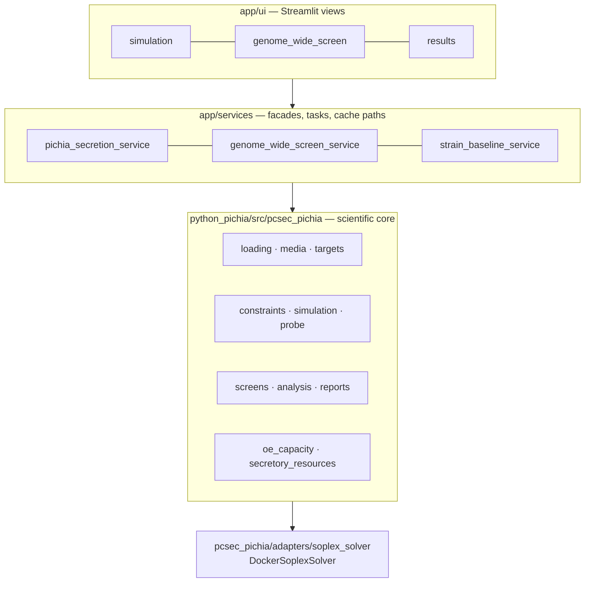

# pcSecPichia — Secretion Pathway Model

[English](README.md) · [中文](README.zh.md)

> Ranks gene knockout / overexpression candidates for recombinant protein secretion in *Pichia pastoris*,
> and returns `unavailable` instead of a number wherever the underlying data cannot support one.

A proteome-constrained metabolic model, reimplemented in Python from a MATLAB codebase and extended
with a screening, attribution and evidence layer. The engineering problem here is not "compute a
number" — it is deciding **which numbers this model is entitled to produce**, and making the rest
fail loudly instead of quietly falling back to a plausible default.

---

## Architecture

Three layers, one-way dependencies. The rule exists because scientific judgment kept leaking upward
into the UI, where no test could see it.



| Layer | Owns | Must not |
| --- | --- | --- |
| `app/ui` | presentation, user actions | change model semantics |
| `app/services` | facades, task triggering, cache paths, error aggregation | implement scientific judgment |
| `python_pichia` | data contracts, constraints, solving, screening, evidence | depend on the UI |
| `Code/` `Model/` `Enzymedata/` `Results/` | legacy MATLAB reference assets | be written to — read-only |

## What it does

| Capability | Entry point |
| --- | --- |
| Genome-wide KO/OE screening — ~1,025 metabolic genes under both directions | [`tools/run_genome_wide_ko_oe_screen_parallel.py`](python_pichia/tools/run_genome_wide_ko_oe_screen_parallel.py) |
| Shadow-price bottleneck attribution — *which* constraint limits secretion, not just *that* it is limited | [`tools/run_target_bottleneck_lp_attribution_check.py`](python_pichia/tools/run_target_bottleneck_lp_attribution_check.py) |
| OE dose–response — quantifies the diminishing return per doubling of expression | [`tools/run_shortlist_dose_response.py`](python_pichia/tools/run_shortlist_dose_response.py) |
| Ranking robustness across capacity assumptions and carbon-source conditions | [`tools/run_shortlist_condition_matrix.py`](python_pichia/tools/run_shortlist_condition_matrix.py) |
| Curated secretory-machinery screen — 61 reactions × KO/OE = 122 candidates | [`screens/genome_wide_tradeoff.py`](python_pichia/src/pcsec_pichia/screens/genome_wide_tradeoff.py) |
| Complex ↔ gene mapping, so complex-level OE becomes a gene a lab can actually build | [`services/gene_complex_mapping_service.py`](app/services/gene_complex_mapping_service.py) |
| Experiment feedback — wet-lab outcomes scored against predicted direction and rank | [`services/pichia_experiment_feedback_service.py`](app/services/pichia_experiment_feedback_service.py) |

Three entry points share one core: a Streamlit UI (`app/ui`), an HTTP API (`app/api`), and 14 batch
tools under `python_pichia/tools/`.

## Quick start

```powershell
python -m streamlit run app/ui/streamlit_app.py --server.address 0.0.0.0 --server.port 8502
```

**Browsing existing screening results needs no solver.** Running a *new* simulation needs SoPlex,
reached through Docker ([`adapters/soplex_solver.py`](python_pichia/src/pcsec_pichia/adapters/soplex_solver.py)).
The split is deliberate: the expensive
dependency is confined to one adapter, so the read path stays runnable anywhere.

## Engineering decisions

Full set in the [ADR index](docs/adr/README.md). The four worth defending:

**Absolute capacity data is permanently missing — so it returns `unavailable`, permanently**
([ADR-002](docs/adr/002-relative-oe-and-absolute-capacity-layers.md) ·
[ADR-004](docs/adr/004-relative-signal-deepening-under-permanent-data-gap.md)).
There is no reviewed baseline capacity anchor, and there may never be one. Every tempting fix —
fall back to the reaction proxy, use baseline optimal flux, use the generic `1000` upper bound,
use a fixture value — produces something that *looks* like an answer. All were rejected. Built
instead: four data-free relative signals (bottleneck attribution, dose–response, ranking robustness,
value-of-information), each meaningful without an absolute anchor.

**COBRApy is a QA tool and an external-GEM entry, not the default backend**
([ADR-009](docs/adr/009-cobrapy-not-the-default-backend.md)).
Moving the whole solve path onto a mainstream library would have been a clean-sounding rewrite. It
was rejected: the accumulated validation is attached to the existing `shadow_lp` / HiGHS /
reference-solve path, and a backend swap discards that validation without adding capability.

**"Matches the old MATLAB implementation" is a claim with a closed vocabulary**
([ADR-008](docs/adr/008-matlab-comparison-claim-boundary.md)).
Seven states, each asserting exactly one thing. Corrected conditions return `pending` **by design**,
not because the comparison failed — and a normalized harness artifact never counts as "the original
target aligned". A closed vocabulary is what stops "we validated against MATLAB" from stretching, in
a slide deck, past what was actually checked.

**Reachability ≠ accuracy** ([ADR-007](docs/adr/007-secretory-machinery-gene-complex-reachability.md)).
The model's gene-protein-reaction rules cover metabolism only; the secretory machinery is 2,793
complex-formation reactions with **zero** gene association. Most curated candidates were therefore
unreachable through a gene-keyed UI — a usability defect that looked like a data gap. The mapping
layer fixes *reachability*; it does not make the numbers more accurate, and saying so is this
README's job because the UI cannot say it.

## Boundaries

What this project will not tell you — stated up front rather than discovered later:

- **Absolute secretion capacity**: always `unavailable`. Relative comparison only.
- **Not modeled**: target-protein degradation, glycan structure, fermentation/process effects, UPR
  dynamics. Wet-lab effects in these areas are outside the model's competence, and it says so rather
  than producing a confident number.
- **Combinatorial intervention search**: deliberately not built — low expected value at the current
  signal-to-noise level.
- **Signal peptide selection**: out of scope, split into a separate project
  ([ADR-010](docs/adr/010-signal-peptide-work-out-of-scope.md)).
- **Wet-lab data** (strains, constructs, titers, loci) lives outside this repository and is not
  published. Only mechanism-level abstractions are committed.
- **Current blockers are data, not code**: RNA-seq expression data
  ([ADR-005](docs/adr/005-rnaseq-expression-constrained-enzyme-capacity.md)) and curator-approved
  complex→gene mappings.

## Documentation

Five documents, split by *what has to happen to make them change*. Status lives in exactly one of
them; the others link to it rather than copying it.

| Document | Changes when |
| --- | --- |
| [Requirements](docs/requirements.md) | the goal or capability boundary changes |
| [Architecture](docs/architecture.md) | the implementation structure changes |
| [Execution plan](docs/EXECUTION_PLAN.md) | progress moves — **sole authority on status** |
| [Handoff](docs/handoff.md) | the active slice changes |
| [ADR index](docs/adr/README.md) | never — decisions are superseded, not edited |

Guard tests enforce the split ([`tests/test_docs_active_boundary.py`](tests/test_docs_active_boundary.py)):
the active document set is asserted by **equality**, so adding a sixth authoritative document turns
the suite red instead of silently creating a second source of truth.

---

> More work at [my personal site](https://77652189.github.io).
