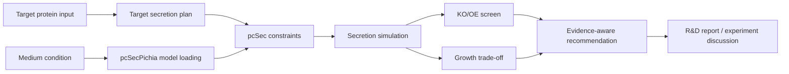
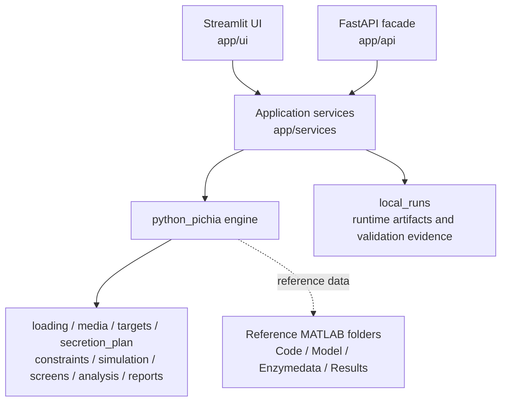

<div align="center">

# pcSecYeastSpecies

**Cross-species yeast secretion models and a Python pcSecPichia workbench for target-protein secretion-engineering decisions**

[](https://www.mathworks.com/products/matlab.html)
[](https://www.python.org/)
[](https://streamlit.io/)
[](LICENSE)

**Language:** English | [Chinese](README.zh.md)

</div>

---

## Overview

This repository contains two related layers:

| Layer | Purpose |
|---|---|
| Original research model | MATLAB code and data for cross-species proteome-constrained modeling of yeast protein secretion in *Saccharomyces cerevisiae*, *Komagataella phaffii*, and *Kluyveromyces marxianus* |
| Current product workbench | A Python `pcSecPichia` engine plus Streamlit/FastAPI facades focused on *K. phaffii* target-protein secretion-design support |

The current applied workflow supports R&D discussions around specific target-protein expression in *Pichia/Komagataella*. It helps compare secretion burden, growth trade-offs, and candidate KO/OE interventions before wet-lab validation.

The Python layer is not a full rewrite of the three-species MATLAB project. It deliberately migrates only the capabilities needed for the current target-protein productivity workflow.

## What It Does

| Capability | Current status |
|---|---|
| Cross-species MATLAB models | Reference model construction, simulation scripts, figure scripts, enzyme data, and processed results are retained under the original folders |
| Python pcSecPichia engine | Loads Pichia model inputs, applies media conditions, builds target-protein secretion plans, adds constraints, solves secretion-capacity scenarios, and summarizes results |
| Target proteins | Supports built-in reference targets, project-specific targets, candidate targets, and custom target inputs |
| Medium conditions | Supports baseline and carbon-source conditions, including mixed-carbon objective probes |
| KO/OE analysis | Supports candidate preview, screen rows, small candidate screens, and genome-wide KO/OE screen tooling |
| Evidence layer | Adds gene catalog, gene-rule overlays, phenotype-evidence tiers, and recommendation wording for manual review |
| Local workbench | Streamlit UI for biology users, with service-layer request mapping, background task support, and report-style outputs |

## Workflow



Upstream tools such as codon optimization and signal peptide screening can provide target-design inputs, but this repository focuses on secretion modeling and KO/OE decision support.

## Architecture



| Area | Key path | Responsibility |
|---|---|---|
| Original reference model | [`Code/`](Code/), [`Model/`](Model/), [`Enzymedata/`](Enzymedata/), [`Results/`](Results/) | MATLAB model construction, source datasets, and manuscript analysis artifacts |
| Python engine | [`python_pichia/src/pcsec_pichia/`](python_pichia/src/pcsec_pichia/) | Pichia model loading, target construction, secretion constraints, simulation, screens, and reports |
| Screen tooling | [`python_pichia/tools/`](python_pichia/tools/) | Genome-wide and focused KO/OE screen runners |
| Service layer | [`app/services/`](app/services/) | Request mapping, background tasks, gene catalog, screen preview, and simulation facade |
| UI layer | [`app/ui/`](app/ui/) | Streamlit pages and biology-facing presentation |
| Working docs | [`docs/README.md`](docs/README.md) | Active scope, current architecture, and execution plan documents |

## Quick Start

### Python workbench

Install dependencies:

```powershell
pip install -r requirements.txt
```

Start the local Streamlit app:

```powershell
python -m streamlit run app/ui/streamlit_app.py --server.address 0.0.0.0 --server.port 8502
```

Or use the Windows launcher:

```powershell
.\start_pcSecYeastSpecies_lan.bat
```

Open:

```text
http://localhost:8502
```

### MATLAB reference workflows

The original MATLAB model requires:

- MATLAB R2020b or later
- [COBRA Toolbox](https://github.com/opencobra/cobratoolbox)
- [RAVEN Toolbox](https://github.com/SysBioChalmers/RAVEN)
- [SoPlex](https://soplex.zib.de/) or the local Docker helper route

Local helpers:

```powershell
.\local_preflight.ps1
.\run_matlab_checks.ps1 -SmokeOnly
.\run_soplex_docker.ps1 -TimeoutSeconds 300
```

Runtime LP files, solver outputs, reports, and UI artifacts are written under `local_runs/` and should remain untracked.

## Scientific Boundaries

- Outputs are for **relative model comparison and candidate prioritization**, not absolute mg/L yield prediction.
- KO/OE results are not wet-lab success guarantees.
- OE can be represented by reaction-level capacity proxies; that is not the same as a full gene-expression regulation model.
- External database annotations support interpretation but do not alone prove phenotype effects.
- Conclusions are target-specific and require alignment checks and experimental validation for each target protein.
- The Python implementation is scoped to current Pichia work and is not a complete migration of all original MATLAB species/features.

## Project Map

```text
pcSecYeastSpecies/
+-- Code/                         # Original MATLAB scripts by species and figures
+-- Model/                        # MATLAB model files
+-- Enzymedata/                   # Species-specific enzyme data
+-- Results/                      # Processed manuscript/reference results
+-- app/
|   +-- services/                 # Python service facades
|   +-- ui/                       # Streamlit workbench
+-- python_pichia/
|   +-- src/pcsec_pichia/         # Python pcSecPichia engine
|   +-- tests/                    # Engine tests
|   +-- tools/                    # KO/OE screen runners
+-- docs/                         # Active planning docs and archived notes
+-- local_runs/                   # Runtime artifacts, ignored by Git
```

## Tests

Focused Python checks:

```powershell
python -m pytest -q python_pichia\tests\test_pipeline_entrypoints.py python_pichia\tests\test_reports_entrypoints.py
python -m pytest -q tests\test_pichia_secretion_service_contract.py
```

Slow solver/model checks are intentionally gated by environment variables. See [Current Requirements And Architecture](docs/pichia_current_architecture_and_requirements.md#慢速测试网关).

## Documentation

| Document | Use it for |
|---|---|
| [Docs Index](docs/README.md) | Current document entry points and archived notes |
| [Current Requirements And Architecture](docs/pichia_current_architecture_and_requirements.md) | Active target-protein workflow, boundaries, and system layering |
| [BLAST/RBH Homology Crosswalk](docs/pichia_homology_crosswalk_architecture.md) | Offline SCE-to-Pichia homology evidence design |
| [Data And Artifact Governance](docs/pichia_current_architecture_and_requirements.md#数据与产物治理) | Protected directories, runtime artifacts, and archive rules |

## Citation And Contact

This repository originates from the pcSecYeastSpecies research model:

**Cross-species proteome-constrained modeling reveals trade-offs in yeast protein secretion under temperature and glycosylation stress**

Original contacts:

- **Lizheng Liu** ([GitHub: @Zephyr-112](https://github.com/Zephyr-112)), Institute of Biopharmaceutical and Health Engineering, Tsinghua Shenzhen International Graduate School, Tsinghua University, Shenzhen, China
- **Feiran Li** ([GitHub: @feiranl](https://github.com/feiranl)), Institute of Biopharmaceutical and Health Engineering, Tsinghua Shenzhen International Graduate School, Tsinghua University, Shenzhen, China

## License

This repository is released under the [MIT License](LICENSE).
