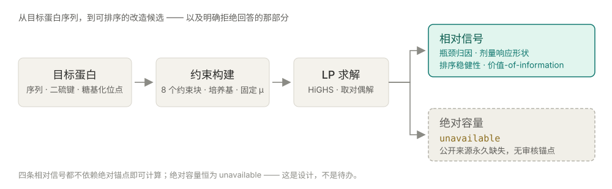
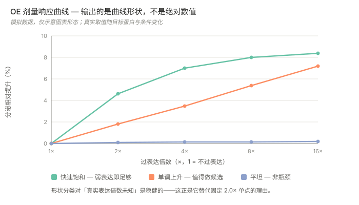
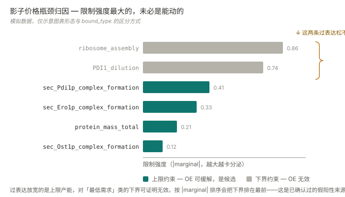
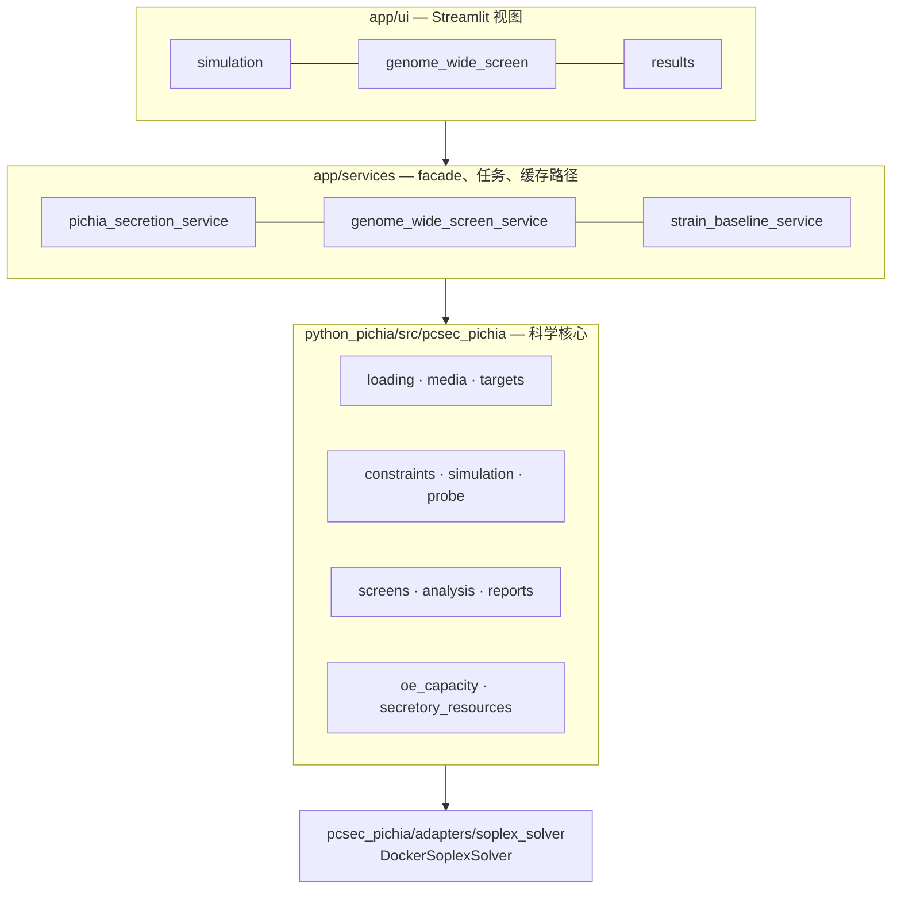

<div align="center">

# pcSecPichia

### 排出下一步该改造什么——数据支撑不了的，它拒绝回答。




[](https://docs.scipy.org/doc/scipy/reference/optimize.linprog-highs.html)
[](https://soplex.zib.de/)
[](python_pichia/tests)
[](docs/adr/002-relative-oe-and-absolute-capacity-layers.md)

[做什么](#做什么) · [快速开始](#快速开始) · [技术栈](#技术栈) · [架构](#架构) · [从 MATLAB 移植](#从-matlab-移植) · [工程要点](#工程要点) · [边界](#边界)

[English](README.md) · [**中文**](README.zh.md)

</div>

---

> 为毕赤酵母重组蛋白分泌排序基因敲除 / 过表达候选；
> 凡是数据支撑不了的量，一律返回 `unavailable`，而不是给一个数。

蛋白质组约束代谢模型，从上游 MATLAB 代码库
（[`LiLabTsinghua/pcSecYeastSpecies`](https://github.com/LiLabTsinghua/pcSecYeastSpecies)）
移植到 Python，并扩出筛查、归因与证据层。
这里的工程问题不是"算出一个数"，而是判断**这个模型有资格给出哪些数**，
再让其余情况响亮地失败——而不是悄悄退回到一个看起来合理的默认值。

## 做什么

| 能力 | 入口 |
| --- | --- |
| 全基因组 KO/OE 筛查——约 1025 个代谢基因，两个方向都跑 | [`tools/run_genome_wide_ko_oe_screen_parallel.py`](python_pichia/tools/run_genome_wide_ko_oe_screen_parallel.py) |
| 影子价格瓶颈归因——回答**哪条约束**卡住分泌，而不只是"被卡住了" | [`tools/run_target_bottleneck_lp_attribution_check.py`](python_pichia/tools/run_target_bottleneck_lp_attribution_check.py) |
| OE 剂量响应——量化每翻一倍表达量的递减回报 | [`tools/run_shortlist_dose_response.py`](python_pichia/tools/run_shortlist_dose_response.py) |
| 排序稳健性——换容量假设、换碳源条件，名次还站得住吗 | [`tools/run_shortlist_condition_matrix.py`](python_pichia/tools/run_shortlist_condition_matrix.py) |
| 策展分泌机器筛查——61 个反应 × KO/OE = 122 个候选 | [`screens/genome_wide_tradeoff.py`](python_pichia/src/pcsec_pichia/screens/genome_wide_tradeoff.py) |
| 复合体 ↔ 基因映射，把"过表达某复合体"翻译成实验室真能构建的基因 | [`services/gene_complex_mapping_service.py`](app/services/gene_complex_mapping_service.py) |
| 实验反馈——湿实验结果按预测方向与名次打分 | [`services/pichia_experiment_feedback_service.py`](app/services/pichia_experiment_feedback_service.py) |

三个入口共用同一个核心：Streamlit 界面（`app/ui`）、HTTP API（`app/api`），
以及 `python_pichia/tools/` 下的 14 个批处理工具。

### 输出长什么样

> 下面两张图使用**模拟数据**，复现真实视图的坐标轴、分类与配色。
> 真实数值贴近湿实验，不公开。

过表达按倍数网格扫描，输出的是响应的**形状分类**，而不是一个数。
形状分类经得起"真实表达倍数未知"这个前提——固定 `2.0×` 单点经不起。



瓶颈归因读取 LP 的对偶解，按**行级**报告哪条约束正卡着。图里能直接看到那个坑：
**限制强度最大的两条是下界**，而过表达放宽的是上限——
所以只按强度排序，会提名一批可证明动不了的靶点。
因此 `bound_type` 必须贯穿每一级汇总，且这条规则写在函数自己产出的 warnings 里，
而不是留在文档里等人去读。



## 快速开始

**浏览已有筛查结果不需要求解器。** 下面这个切分就是为了这件事——
把重依赖关在一个 adapter 里，读取路径才能在任何机器上跑起来。

```bash
git clone https://github.com/77652189/pcSecYeastSpecies.git
cd pcSecYeastSpecies
pip install -r requirements.txt
```

```powershell
./run_streamlit.ps1
```

默认开在 `http://localhost:8502`，`-Port` / `-Address` 可改。非 Windows 环境，
或者不想用启动脚本：

```bash
PYTHONPATH=.:python_pichia/src python -m streamlit run app/ui/streamlit_app.py --server.port 8502
```

> 注意是 `python -m streamlit` 而不是 `streamlit run`——后者的控制台脚本会把**它自己所在的
> 目录**放进 `sys.path[0]`，而不是仓库根目录，于是 `app.*` 的绝对导入全部失败。
> 启动脚本设 `PYTHONPATH` 也是为了同一件事。

### 跑新仿真：Docker 里的 SoPlex

跑**新**仿真才需要参照求解器。它只经由一个 adapter 调用
（[`adapters/soplex_solver.py`](python_pichia/src/pcsec_pichia/adapters/soplex_solver.py)），
在容器里执行——除 Docker 本身外，宿主机不装任何东西。

镜像构建一次即可：

```bash
docker build -t pcsec-soplex:24.04 docker/soplex
```

[`docker/soplex/Dockerfile`](docker/soplex/Dockerfile) 就是 Ubuntu 24.04 加发行版
`soplex` 包——整个镜像只有这些。随后 `DockerSoplexSolver` 把 LP 所在目录挂成容器工作目录，
并把求解器输出解析回带类型的结果，因此**非最优解会表现为 `success = False`，
而不是一个看起来合理的数**。

WSL 用户可以改为把 SoPlex 装进 `Ubuntu-24.04` 发行版：
[`setup_wsl_soplex.ps1`](setup_wsl_soplex.ps1)。

[`run_soplex_docker.ps1`](run_soplex_docker.ps1) 是**冒烟校验，不是通用入口**——
它重放 MATLAB harness（`local_smoke_sce_glc`）产生的 run 目录，
除非 SoPlex 报告 `problem is solved [optimal]` 且给出目标值，否则直接报错退出。
没有 MATLAB 时它会停在"缺少 run 目录"，这是设计如此。

### 批处理工具

```bash
python python_pichia/tools/run_genome_wide_ko_oe_screen_parallel.py
```

14 个工具的产物都落在 `local_runs/`，该目录 gitignored、可随时删除——
求解结果是内容寻址缓存的，删掉会重算。

### HTTP API（实验性）

[`app/api/pichia_secretion_api.py`](app/api/pichia_secretion_api.py) 是同一套服务层之上的
一层薄 FastAPI facade。**`fastapi` 与 `uvicorn` 不在 `requirements.txt` 里**，
需要这条路径的话请另行安装：

```bash
pip install fastapi uvicorn
uvicorn app.api.pichia_secretion_api:app --port 8000
```

### 验证安装

```bash
python -m pytest -q python_pichia/tests/test_target_entrypoints.py python_pichia/tests/test_constraints_entrypoints.py
```

真实求解回归默认跳过，按类别分别显式开启——这样日常套件快到有人愿意跑：

| 环境变量 | 覆盖 |
| --- | --- |
| `PCSEC_RUN_SLOW_PIPELINE_TESTS=1` | 单候选全流程求解 |
| `PCSEC_RUN_SLOW_SCREEN_TESTS=1` | 全模型 KO/OE 批量筛查 |
| `PCSEC_RUN_SLOW_PROBE_TESTS=1` | probe 迁移回归，对照既有基线产物 |

## 技术栈

| 层 | 选型 | 为什么是它 |
| --- | --- | --- |
| LP 求解（默认） | SciPy HiGHS — `highs-ds`、`highs-ipm` | 确定性，且**能拿到对偶解**；整个瓶颈归因层就建在这些 marginal 上 |
| LP 求解（参照） | Ubuntu 24.04 容器里的 SoPlex | 与 MATLAB 基线同一个求解器，比对才是同类比同类 |
| 模型数据 | `h5py` | 模型是 MATLAB v7.3 `.mat`，就地读取而不转格式——转了就会和上游漂移 |
| 数值 | NumPy · `scipy.sparse` · pandas | 约束矩阵大且稀疏，按 CSR 逐行构建再堆叠 |
| 界面 | Streamlit + Plotly | 单用户本地研究工具，拆前后端是纯成本 |
| HTTP API | FastAPI *（实验性，且依赖未声明）* | 从界面之外触发批处理 |
| 契约 | Pydantic v2 | 请求与结果 schema，让降级原因是**带类型的**而不是字符串 |
| 序列 | Biopython · `python-libsbml` | 目标蛋白序列与 SBML 交换 |
| 外部证据 | `httpx` + `tenacity` | UniProt / NCBI / KEGG / SGD 抓取，缓存进 `local_runs/` 并保留来源、版本、hash、license |
| 报告 | OpenAI SDK | LLM **只**读程序生成的 fact pack，输出还须过程序 validator 与 Judge |
| 测试 | pytest | 152 个测试文件；慢速真实求解由环境变量显式开关 |

Python **3.10+**。科学核心 `python_pichia/` 是一个可安装包，自带 `pyproject.toml`，
且**不依赖 Streamlit**——界面依赖核心，反向不成立。

## 架构

三层，依赖单向。这条规则的由来是：科学判断会顺着调用链往上渗到界面里，
而渗上去之后，测试就再也看不见它了。



| 层 | 拥有 | 不许 |
| --- | --- | --- |
| `app/ui` | 展示与用户操作 | 改动模型语义 |
| `app/services` | facade、任务触发、缓存路径、错误汇总 | 实现科学判断 |
| `python_pichia` | 数据契约、约束、求解、筛查、证据 | 反向依赖界面 |
| `Code/` `Model/` `Enzymedata/` `Results/` | legacy MATLAB 参考资产 | 被写入——只读 |

## 从 MATLAB 移植

上游是三个酵母物种、约 253 个 MATLAB 文件。全量翻译被否掉了——
理由不是工作量大，是**没有服务对象**。砍两刀：先砍到毕赤酵母（约 75 个文件），
再砍到研发实际会走的那条执行链。不做的东西被逐条写了下来，
因为**没写下来的排除项，会以"顺手也做了吧"的形式回来**。

**正确性是靠比 LP 本身建立的，不是比答案。** Python 侧用参照实现自己的索引格式写出它的 LP，
两边由同一个 parser 解析，再逐行 diff 到单个系数与边界
（[`alignment/lp_diff.py`](python_pichia/src/pcsec_pichia/alignment/lp_diff.py)）。
「目标值相对差 ≤1% 即判对齐」作为判据被否掉了——两套结构不同的 LP 完全可能给出接近的最优值。
差异按含义加权，一个缺失变量的严重度高于上千条纯格式的标签差异，
否则第一次 diff 根本没法读。

**而那点残留差异，结果是移植修正，不是移植错误。** 行数、列数差异均为 0；
0.83% 的目标值差异由四条具名、计数、且被测试断言的项完全解释。
它们背后是同一个根因：缺失的数据被填上了占位值——变量固定为 `0`（这条通路永不发生）
或放开到 `±1000`（无限制）。两者都不是生物学结论。
所以忠实性是反过来证明的——照搬参照实现的参数（一等的 `matlab_compat` 模式），结果一致。

**这一判断还有个外部旁证。** 上游提交
[`cbc0a33b`](https://github.com/LiLabTsinghua/pcSecYeastSpecies/commit/cbc0a33b)（2026-06-15）
新增了 `Code/pcSecPichia/CoreFunction/setMediaPP.m`——这个设定培养基边界的函数
此前根本不在公开仓库里，任何人复现都会撞上同一批占位值。
它落地的时间比本仓库对齐工作收口早约一周。
两个互不知情的实现者，对同一批边界得出了同一个结论。

## 工程要点

完整清单见 [ADR 索引](docs/adr/README.md)。这四条最经得起追问：

**绝对容量数据是永久缺失的——所以它永久返回 `unavailable`**
（[ADR-002](docs/adr/002-relative-oe-and-absolute-capacity-layers.md) ·
[ADR-004](docs/adr/004-relative-signal-deepening-under-permanent-data-gap.md)）。
没有经过审核的 baseline capacity 锚点，而且可能永远不会有。
所有诱人的补救——退回 reaction proxy、用 baseline 最优 flux、用通用上界 `1000`、用 fixture 值——
都能造出一个**看起来像答案**的东西。全部否掉。
改为建四项免数据的相对信号（瓶颈归因、剂量响应、排序稳健性、value-of-information），
每一项在没有绝对锚点的前提下依然成立。

**COBRApy 只作 QA 与外部 GEM 入口，不作默认后端**
（[ADR-009](docs/adr/009-cobrapy-not-the-default-backend.md)）。
把整条求解路径搬到主流库上，听起来是一次干净的重写。否掉的理由是：
已积累的验证是挂在现有 `shadow_lp` / HiGHS / reference solve 路径上的，
换后端等于把那批验证丢掉，却不换来任何新能力。

**"与旧 MATLAB 实现对得上"是一句有封闭词表的声称**
（[ADR-008](docs/adr/008-matlab-comparison-claim-boundary.md)）。
七种状态，每种只说一件事。修正过的条件恒返回 `pending`——这是**设计意图**：
修正后的条件与基线不是同一个条件，跨条件的数值接近只是一个看起来有依据的结论。
封闭词表的作用，是让"我们对照 MATLAB 验证过"这句话，
没法在演示材料里被拉伸到超出真正核过的范围。

**可达性 ≠ 准确度**（[ADR-007](docs/adr/007-secretory-machinery-gene-complex-reachability.md)）。
模型的基因-反应关联（GPR）只覆盖代谢；分泌机器是 **2793 个复合体形成反应、零基因关联**。
于是大部分策展候选在以基因为键的界面上根本点不到——
一个长得像"数据缺口"的**易用性缺陷**。映射层修的是**可达性**，
它不会让数字更准；这句话得写在 README 里，因为界面说不出口。

## 边界

这个项目不会告诉你什么——写在前面，而不是让人用到一半才发现：

- **绝对分泌容量**：恒为 `unavailable`，只做相对比较。
- **不建模**：目标蛋白降解、糖型结构、发酵/工艺效应、UPR 动力学。
  这些方向上观察到的湿实验现象超出模型能力范围，它会明说，而不是给一个自信的数。
- **组合改造搜索**：明确不做——以当前信噪比看，期望收益太低。
- **信号肽筛选**：不在范围内，已拆为独立项目
  （[ADR-010](docs/adr/010-signal-peptide-work-out-of-scope.md)）。
- **湿实验数据**（菌株、构建、产量、位点）存放在本仓库之外，不公开。
  提交进来的只有机制层抽象。
- **当前卡点是数据不是代码**：RNA-seq 表达数据
  （[ADR-005](docs/adr/005-rnaseq-expression-constrained-enzyme-capacity.md)）
  与经策展人审核的复合体→基因映射。

## 文档

五份文档，按*什么事发生了会让它需要改*来切分。
状态只住在其中一份里，其余只链接、不复制。

| 文档 | 什么时候改 |
| --- | --- |
| [需求](docs/requirements.md) | 目标或能力边界变了 |
| [架构](docs/architecture.md) | 实现结构变了 |
| [执行计划](docs/EXECUTION_PLAN.md) | 进度推进了——**状态的唯一权威** |
| [handoff](docs/handoff.md) | 当前切片换了 |
| [ADR 索引](docs/adr/README.md) | 从不改——决策只被取代，不被改写 |

守卫测试强制这条切分（[`tests/test_docs_active_boundary.py`](tests/test_docs_active_boundary.py)）：
active 文档集合按**相等**断言，多出第六份权威文档会让测试变红，
而不是悄悄多出第二个状态权威。

## 致谢

pcSec 模型与 MATLAB 实现是上游
[`LiLabTsinghua/pcSecYeastSpecies`](https://github.com/LiLabTsinghua/pcSecYeastSpecies) 的工作。
本仓库贡献的是毕赤酵母执行链的 Python 移植，以及建立在其上的筛查、归因与证据层。

---

<div align="center">

更多项目见[个人网站](https://77652189.github.io)。

</div>
