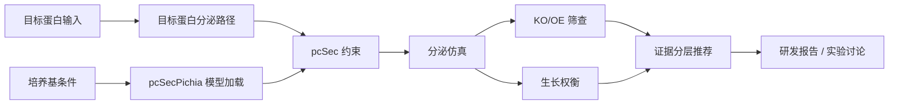
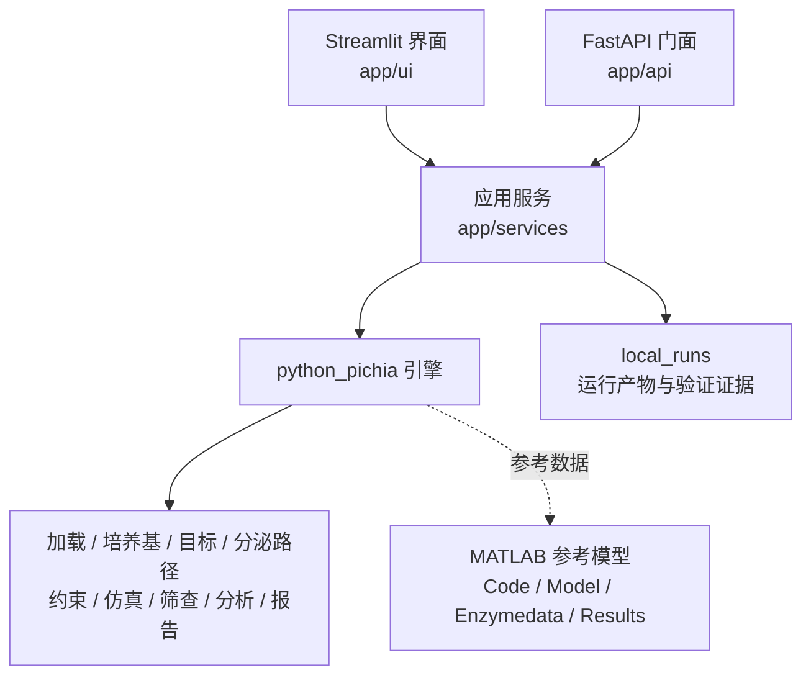

<div align="center">

# pcSecYeastSpecies

**跨物种酵母分泌模型，以及面向目标蛋白分泌工程决策的 Python pcSecPichia 工作台**

[](https://www.mathworks.com/products/matlab.html)
[](https://www.python.org/)
[](https://streamlit.io/)
[](LICENSE)

**语言：** [英文](README.md) | 中文

</div>

---

## 项目简介

本仓库包含两层内容：

| 层级 | 作用 |
|---|---|
| 原始研究模型 | 面向 *Saccharomyces cerevisiae*、*Komagataella phaffii* 和 *Kluyveromyces marxianus* 的跨物种蛋白分泌通量约束模型，主要由 MATLAB 代码、模型和结果数据组成 |
| 当前应用工作台 | 围绕 *K. phaffii* 中目标蛋白分泌表达设计的 Python `pcSecPichia` 引擎，以及 Streamlit / FastAPI 外壳 |

当前应用主线服务于研发讨论：在特定目标蛋白的毕赤酵母表达场景下，比较分泌负担、生长权衡和 KO/OE 改造候选，为湿实验前的候选优先级判断提供依据。

Python 层不是三物种 MATLAB 项目的完整重写，而是只迁移当前目标蛋白产量提升工作流需要的能力。

## 当前能力

| 能力 | 状态 |
|---|---|
| 跨物种 MATLAB 模型 | 原始构建脚本、仿真脚本、figure 脚本、酶数据和处理结果保留在原目录 |
| Python pcSecPichia 引擎 | 支持 Pichia 输入加载、培养基条件、目标蛋白分泌路径、约束构建、求解和结果摘要 |
| 目标蛋白 | 支持内置参考目标、项目专属目标、候选目标和自定义目标输入 |
| 培养基条件 | 支持基础碳源条件和混合碳源目标探针 |
| KO/OE 分析 | 支持候选预览、筛查结果行、小规模候选筛查和全基因组 KO/OE 筛查工具 |
| 证据层 | 支持基因目录、基因规则覆盖、表型证据分层和人工复核提示 |
| 本地工作台 | 提供面向生物研发用户的 Streamlit 页面、后台任务和报告式输出 |

## 工作流程



密码子优化、信号肽筛选等上游工具可以为目标蛋白设计提供输入；本仓库重点负责分泌模型评估和 KO/OE 决策支持。

## 架构概览



| 区域 | 关键路径 | 职责 |
|---|---|---|
| 原始模型 | [`Code/`](Code/), [`Model/`](Model/), [`Enzymedata/`](Enzymedata/), [`Results/`](Results/) | MATLAB 模型构建、原始数据和论文结果 |
| Python 引擎 | [`python_pichia/src/pcsec_pichia/`](python_pichia/src/pcsec_pichia/) | Pichia 模型加载、目标构建、分泌约束、仿真、筛查和报告 |
| 筛查工具 | [`python_pichia/tools/`](python_pichia/tools/) | 全基因组和局部 KO/OE 筛查脚本 |
| 服务层 | [`app/services/`](app/services/) | 请求映射、后台任务、基因目录、筛查预览和仿真门面 |
| UI 层 | [`app/ui/`](app/ui/) | Streamlit 页面和研发可读展示 |
| 工作文档 | [`docs/README.md`](docs/README.md), [`docs/pichia_next_plan.md`](docs/pichia_next_plan.md) | 当前范围、架构和下一步计划 |

## 快速开始

### Python 工作台

安装依赖：

```powershell
pip install -r requirements.txt
```

启动本地 Streamlit 页面：

```powershell
python -m streamlit run app/ui/streamlit_app.py --server.address 0.0.0.0 --server.port 8502
```

也可以使用 Windows 启动脚本：

```powershell
.\start_pcSecYeastSpecies_lan.bat
```

打开：

```text
http://localhost:8502
```

### MATLAB 参考流程

原始 MATLAB 模型需要：

- MATLAB R2020b 或更高版本
- [COBRA Toolbox](https://github.com/opencobra/cobratoolbox)
- [RAVEN Toolbox](https://github.com/SysBioChalmers/RAVEN)
- [SoPlex](https://soplex.zib.de/) 或本地 Docker 辅助路径

本地辅助命令：

```powershell
.\local_preflight.ps1
.\run_matlab_checks.ps1 -SmokeOnly
.\run_soplex_docker.ps1 -TimeoutSeconds 300
```

LP 文件、求解输出、报告和 UI 运行产物会写入 `local_runs/`，不应提交到源码仓库。

## 科学边界

- 输出用于**模型内相对比较和候选优先级排序**，不预测绝对 mg/L 产量。
- KO/OE 结果不是实验成功率承诺。
- OE 通常可能以反应层面的容量代理表示，并不等同于完整基因表达调控模型。
- 外部数据库注释只能辅助解释，不能单独证明表型效果。
- 结论具有目标蛋白特异性，每个目标蛋白都需要单独的对齐检查和湿实验验证。
- Python 实现范围限定在当前 Pichia 工作流，不是所有 MATLAB 物种和功能的完整迁移。

## 项目结构

```text
pcSecYeastSpecies/
+-- Code/                         # 原始 MATLAB 脚本
+-- Model/                        # MATLAB 模型文件
+-- Enzymedata/                   # 物种酶数据
+-- Results/                      # 论文和参考结果
+-- app/
|   +-- services/                 # Python 服务门面
|   +-- ui/                       # Streamlit 工作台
+-- python_pichia/
|   +-- src/pcsec_pichia/         # Python pcSecPichia 引擎
|   +-- tests/                    # 引擎测试
|   +-- tools/                    # KO/OE 筛查脚本
+-- docs/                         # 当前工作文档和归档记录
+-- local_runs/                   # 本地运行产物，Git 忽略
```

## 测试

常用局部检查：

```powershell
python -m pytest -q python_pichia\tests\test_pipeline_entrypoints.py python_pichia\tests\test_reports_entrypoints.py
python -m pytest -q tests\test_pichia_secretion_service_contract.py
```

慢速求解/模型检查由环境变量显式开启，详见 [下一步规划](docs/pichia_next_plan.md)。

## 文档

| 文档 | 用途 |
|---|---|
| [文档索引](docs/README.md) | 当前文档入口和归档记录 |
| [当前需求与架构](docs/pichia_current_architecture_and_requirements.md) | 目标蛋白工作流、科学边界和系统分层 |
| [下一步规划](docs/pichia_next_plan.md) | BLAST/RBH cache、Shadow LP 后端切换和证据整合优先级 |
| [BLAST/RBH 同源映射架构](docs/pichia_homology_crosswalk_architecture.md) | 酿酒酵母到 Pichia 的离线同源证据层设计 |
| [数据与结果治理策略](docs/data_and_results_policy.md) | 保护目录、运行产物和归档规则 |

## 引用与联系人

本仓库源自 pcSecYeastSpecies 研究模型：

**Cross-species proteome-constrained modeling reveals trade-offs in yeast protein secretion under temperature and glycosylation stress**

原始联系人：

- **Lizheng Liu** ([GitHub: @Zephyr-112](https://github.com/Zephyr-112))，清华大学深圳国际研究生院生物医药与健康工程研究院
- **Feiran Li** ([GitHub: @feiranl](https://github.com/feiranl))，清华大学深圳国际研究生院生物医药与健康工程研究院

## 许可证

本仓库使用 [MIT 许可证](LICENSE)。
