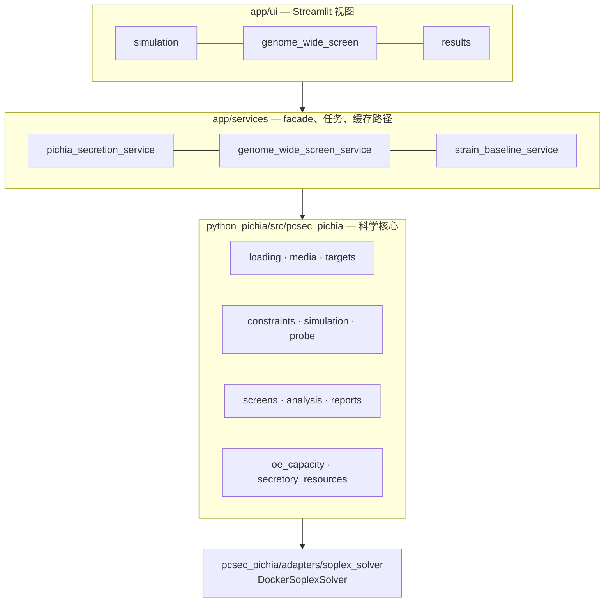

# pcSecPichia 分泌通路模型

[English](README.md) · [中文](README.zh.md)

> 为毕赤酵母重组蛋白分泌排序基因敲除 / 过表达候选；
> 凡是数据支撑不了的量，一律返回 `unavailable`，而不是给一个数。

蛋白质组约束代谢模型，从 MATLAB 代码库重写为 Python，并扩出筛查、归因与证据层。
这里的工程问题不是"算出一个数"，而是判断**这个模型有资格给出哪些数**，
再让其余情况响亮地失败——而不是悄悄退回到一个看起来合理的默认值。

---

## 架构

三层，依赖单向。这条规则的由来是：科学判断会顺着调用链往上渗到界面里，
而渗上去之后，测试就再也看不见它了。



| 层 | 拥有 | 不许 |
| --- | --- | --- |
| `app/ui` | 展示与用户操作 | 改动模型语义 |
| `app/services` | facade、任务触发、缓存路径、错误汇总 | 实现科学判断 |
| `python_pichia` | 数据契约、约束、求解、筛查、证据 | 反向依赖界面 |
| `Code/` `Model/` `Enzymedata/` `Results/` | legacy MATLAB 参考资产 | 被写入——只读 |

## 实现了什么

| 能力 | 入口 |
| --- | --- |
| 全基因组 KO/OE 筛查——约 1025 个代谢基因，两个方向都跑 | [`tools/run_genome_wide_ko_oe_screen_parallel.py`](python_pichia/tools/run_genome_wide_ko_oe_screen_parallel.py) |
| 影子价格瓶颈归因——回答**哪条约束**卡住分泌，而不只是"被卡住了" | [`tools/run_target_bottleneck_lp_attribution_check.py`](python_pichia/tools/run_target_bottleneck_lp_attribution_check.py) |
| OE 剂量响应——量化每翻一倍表达量的递减回报 | [`tools/run_shortlist_dose_response.py`](python_pichia/tools/run_shortlist_dose_response.py) |
| 排序稳健性——换容量假设、换碳源条件，名次还站得住吗 | [`tools/run_shortlist_condition_matrix.py`](python_pichia/tools/run_shortlist_condition_matrix.py) |
| 策展分泌机器筛查——61 个反应 × KO/OE = 122 个候选 | [`screens/genome_wide_tradeoff.py`](python_pichia/src/pcsec_pichia/screens/genome_wide_tradeoff.py) |
| 复合体 ↔ 基因映射，把"过表达某复合体"翻译成实验室真能构建的基因 | [`services/gene_complex_mapping_service.py`](app/services/gene_complex_mapping_service.py) |
| 实验反馈——湿实验结果按预测方向与名次打分 | [`services/pichia_experiment_feedback_service.py`](app/services/pichia_experiment_feedback_service.py) |

三个入口共用同一个核心：Streamlit 界面（`app/ui`）、HTTP API（`app/api`），
以及 `python_pichia/tools/` 下的 14 个批处理工具。

## 快速开始

```powershell
python -m streamlit run app/ui/streamlit_app.py --server.address 0.0.0.0 --server.port 8502
```

**浏览已有筛查结果不需要求解器。** 跑**新**仿真才需要 SoPlex，
经 Docker 调用（[`adapters/soplex_solver.py`](python_pichia/src/pcsec_pichia/adapters/soplex_solver.py)）。
这个切分是刻意的：
把重依赖关在一个 adapter 里，读取路径才能在任何机器上跑起来。

## 工程要点

完整清单见 [ADR 索引](docs/adr/README.md)。这四条最经得起追问：

**绝对容量数据是永久缺失的——所以它永久返回 `unavailable`**
（[ADR-002](docs/adr/002-relative-oe-and-absolute-capacity-layers.md) ·
[ADR-004](docs/adr/004-relative-signal-deepening-under-permanent-data-gap.md)）。
没有经过审核的 baseline capacity 锚点，而且可能永远不会有。
所有诱人的补救——退回 reaction proxy、用 baseline 最优 flux、用通用上界 `1000`、用 fixture 值——
都能造出一个**看起来像答案**的东西。全部否掉。
改为建四项免数据的相对信号（瓶颈归因、剂量响应、排序稳健性、value-of-information），
每一项在没有绝对锚点的前提下依然成立。

**COBRApy 只作 QA 与外部 GEM 入口，不作默认后端**
（[ADR-009](docs/adr/009-cobrapy-not-the-default-backend.md)）。
把整条求解路径搬到主流库上，听起来是一次干净的重写。否掉的理由是：
已积累的验证是挂在现有 `shadow_lp` / HiGHS / reference solve 路径上的，
换后端等于把那批验证丢掉，却不换来任何新能力。

**"与旧 MATLAB 实现对得上"是一句有封闭词表的声称**
（[ADR-008](docs/adr/008-matlab-comparison-claim-boundary.md)）。
七种状态，每种只说一件事。修正过的条件恒返回 `pending`——这是**设计意图**，不是对照失败；
而 harness 归一化产物永远不等于"原始目标已对齐"。
封闭词表的作用，是让"我们对照 MATLAB 验证过"这句话，
没法在演示材料里被拉伸到超出真正核过的范围。

**可达性 ≠ 准确度**（[ADR-007](docs/adr/007-secretory-machinery-gene-complex-reachability.md)）。
模型的基因-反应关联（GPR）只覆盖代谢；分泌机器是 **2793 个复合体形成反应、零基因关联**。
于是大部分策展候选在以基因为键的界面上根本点不到——
一个长得像"数据缺口"的**易用性缺陷**。映射层修的是**可达性**，
它不会让数字更准；这句话得写在 README 里，因为界面说不出口。

## 边界

这个项目不会告诉你什么——写在前面，而不是让人用到一半才发现：

- **绝对分泌容量**：恒为 `unavailable`，只做相对比较。
- **不建模**：目标蛋白降解、糖型结构、发酵/工艺效应、UPR 动力学。
  这些方向上观察到的湿实验现象超出模型能力范围，它会明说，而不是给一个自信的数。
- **组合改造搜索**：明确不做——以当前信噪比看，期望收益太低。
- **信号肽筛选**：不在范围内，已拆为独立项目
  （[ADR-010](docs/adr/010-signal-peptide-work-out-of-scope.md)）。
- **湿实验数据**（菌株、构建、产量、位点）存放在本仓库之外，不公开。
  提交进来的只有机制层抽象。
- **当前卡点是数据不是代码**：RNA-seq 表达数据
  （[ADR-005](docs/adr/005-rnaseq-expression-constrained-enzyme-capacity.md)）
  与经策展人审核的复合体→基因映射。

## 文档

五份文档，按*什么事发生了会让它需要改*来切分。
状态只住在其中一份里，其余只链接、不复制。

| 文档 | 什么时候改 |
| --- | --- |
| [需求](docs/requirements.md) | 目标或能力边界变了 |
| [架构](docs/architecture.md) | 实现结构变了 |
| [执行计划](docs/EXECUTION_PLAN.md) | 进度推进了——**状态的唯一权威** |
| [handoff](docs/handoff.md) | 当前切片换了 |
| [ADR 索引](docs/adr/README.md) | 从不改——决策只被取代，不被改写 |

守卫测试强制这条切分（[`tests/test_docs_active_boundary.py`](tests/test_docs_active_boundary.py)）：
active 文档集合按**相等**断言，多出第六份权威文档会让测试变红，
而不是悄悄多出第二个状态权威。

---

> 更多项目见[个人网站](https://77652189.github.io)。
